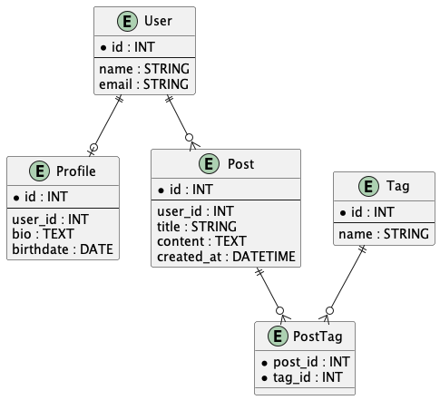

# README

This is a basic rails app.

It only has models, with common entity relationships for practice. Nothing more.

## ER diagram

This is what the model structure looks like.

Made with plantUML text in `docs/erd.puml`

## TODO

You can play with this app however you want. Here are some ideas:

- Complete controllers
- Add frontend
  - Rails views
  - Other frontend frameworks (e.g., React, Vue)
- Write tests
  - Built-in Rails tests or RSpec
  - Use FactoryBot for factories
- Add or modify models
  - Make DB migrations
- Switch database
  - Change from SQLite to MySQL or PostgreSQL
- Implement authentication and authorization
- Explore background jobs
  - Use ActiveJob or Sidekiq for async processing
